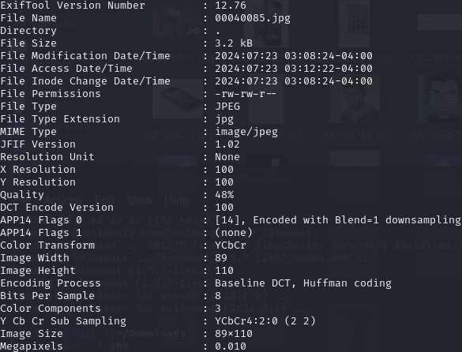
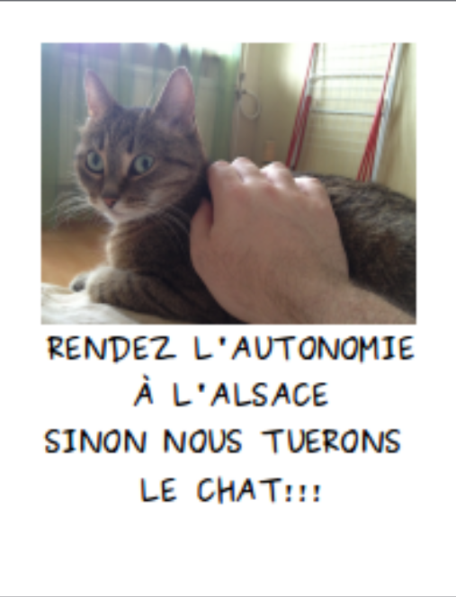
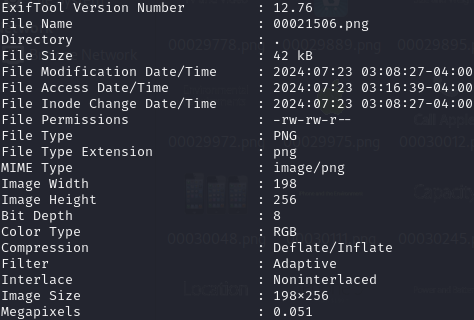
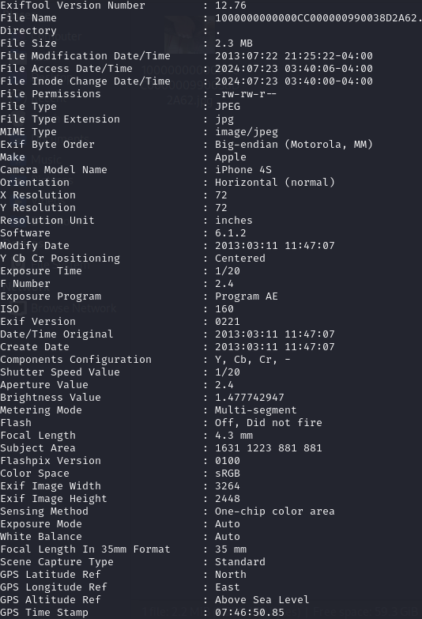
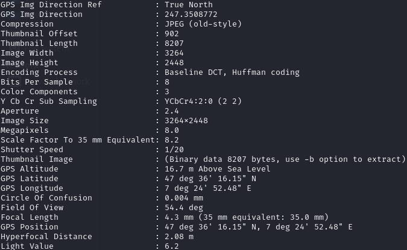

# Root Me


## Forensic - Trouvez le chat

### Énoncé

Le chat du président a été kidnappé par des indépendantistes. Un suspect a été interpellé par la gendarmerie. Il détenait sur lui une clef USB. Berthier, une nouvelle fois, à vous de jouer ! Essayez de faire parler cette clef et de trouver dans quelle ville est retenu ce chat !

La somme md5 de l’archive est edf2f1aaef605c308561888079e7f7f7. Entrez la ville en minuscule.

### 2 vulnérabilités

* Forensic - Metadata
* Outil - Photorec

## 1 ressource associées

* Data sanitization and recovery (Forensic)
---
### 🔑 Première Phase - Clef USB 🔑

Ainsi, nous sommes missionnés pour retrouver le chat du président.

Pour ce faire, nous allons utiliser notre meilleure machine Kali Linux et réussir ce challenge !

Nous avons une seule ressource à notre disposition. Un fichier ch9.gz qui correspond à la clef USB du ravisseur.

Première étape, nous devons décompresser ce fichier pour voir ce qu'il y a l'intérieur. Pour ce faire nous allons utiliser la commande **gunzip** qui permet de décompresser les fichiers compressés au format **.gz**.

```BASH
gunzip ch9.gz
```

Ainsi, nous allons avoir un fichier qui en ressort, le fichier ch9. Nous ne connaissons pas l'extension du fichier. On pourrait se poser beaucoup de questions pour savoir quoi en faire. Mais dans l'énoncé du challenge, nous pouvons voir que l'on nous propose d'utiliser un outil du nom de **Photorec**.
Photorec est un outil qui permet la récupération de données perdues, tels que des photos, des documents, des vidéos et d'autres types de fichiers.

Étant sur une machine Kali, je me suis posé la question suivante "Existerait-il pas un autre outil qui pourrait faire la même chose que Photorec ?🤔"

Après quelque recherche, j'ai trouvé un outil open-source qui permet de récupérer des fichiers supprimés à partir de disques durs, de cartes mémoire, de clés USB, et d'autres support de stockage.

Ce qui tombe bien, car nous avons des reliquats d'une clef USB.

Nous allons donc installer l'outil **foremost**.

```BASH
sudo apt install foremost
```
Maintenant, nous pouvons utiliser l'outil.

```BASH
foremost cha9
```
Après la fin de l'extraction du fichier nous allons avoir dossier avec toutes les données de la clef USB.

### 🔎 Deuxième phase - Recherche d'indice 🔎

Nous avons donc un dossier avec tout ce qui était contenu dans la clef USB. Maintenant, nous devons faire un travail de recherche, pour voir si notre ravisseur n'aurait pas laissé des indices ou des traces pour retrouver ce pauvre chat.

Nous pouvons regarder dans le premier dossier qui se nomme **gif**, il y contient uniquement des gifs... Rien de bien intéressant. Le prochain dossier est le dossier **htm**, il y contient des fichiers htm qui sont en soit des fichier html. Après vérification de plusieurs fichiers, nous constatons qu'il n'y a rien d'intéressant à l'intérieur de celui-ci. Nous pouvons passer au dossier suivant qui est JPEG. À l'intérieur, vous pouvez le deviner, il contient des fichiers JPEG, mais un des fichiers à l'intérieur est intéressant. Le fichier se nommant **00040085.jpg** contient une image de chat, peut-être somme nous proches du but !? 

Mais que faire de cette photo ? Comme pour la première phase, nous pouvons voir que dans l'énoncé, il parle de **metadata**. Les metadata (ou métadonnées en français) donnent des informations sur d'autres données. Elles fournissent des détails supplémentaires qui aident à identifier, décrire, gérer ou organiser les ressources d'information.

Nous allons donc regarder les metadata de la photo. Nous allons utiliser l'outil exiftool qui permet de lire, d'écrire et d'éditer les métadonnées de divers types de fichiers.

Depuis notre dossier contenant la photo, nous allons ouvrir un terminal et taper la commande suivante :

```BASH
exiftool 00040085.jpg
```



Ainsi, malheureusement, nous ne pouvons rien exploiter de ces informations...

Nous sommes repartis pour vérifier les autres dossiers. Nous passons par le dossier ole, pdf et png. Mais dans celui-ci, nous pouvons voir plusieurs, dont une qui retient notre attention. La photo **00021506.png**. 



Après avoir vu cette image, on peut faire comme la précédente image, on va analyser ces metadata.

```BASH
exiftool 00021506.png
```
Malheureusement, nous n'avons toujours pas d'information nous permettant de retrouver le chat.



Nous y sommes presque ! 

### 😺 Partie trois - Retrouvons le chat 😺

Nous allons regarder dans le dernier dossier. Ce dernier se nomme zip, nous pouvons voir qu'à l'intérieur, il y a deux fichiers zip. Un nommé 0021506 et 00028695. 

L'un des fichiers se nomme exactement comme la photo. Nous allons alors le dézipper et voir ce qu'il y a l'intérieur. Nous pouvons voir plusieurs dossiers et fichiers. Mon premier reflex et d'aller voir dans le dossier photo. 

Ainsi, nous pouvons voir qu'il y a la photo qui a été utilisée dans le précédent fichier. Nous pouvons vérifier les metada de cette dernière image. 

```BASH
exiftool 1000000000000CC000000990038D2A62.jpg
```





Nous avons beaucoup plus d'information que sur les autres fichiers. Nous pouvons voir plusieurs informations telles que la marque du téléphone, le modèle du téléphone. Ainsi que l'information la plus importante la position GPS au moment où la photo a été prise.

Il nous reste plus grand-chose à faire à présent. Nous allons prendre les coordonnées et les rentrer sur Google maps :

>47 36' 16.15" N 7 24' 52.48" E

Maintenant, nous savons dans quel village le chat est détenu par le ravisseur.